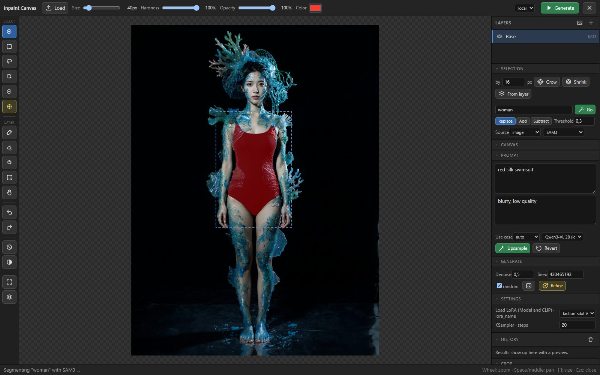
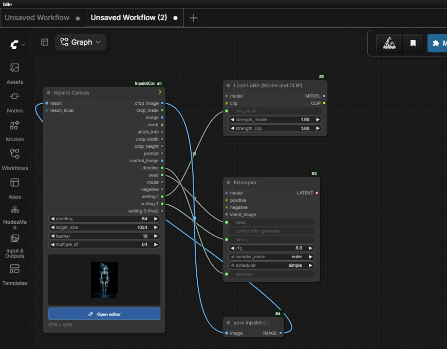
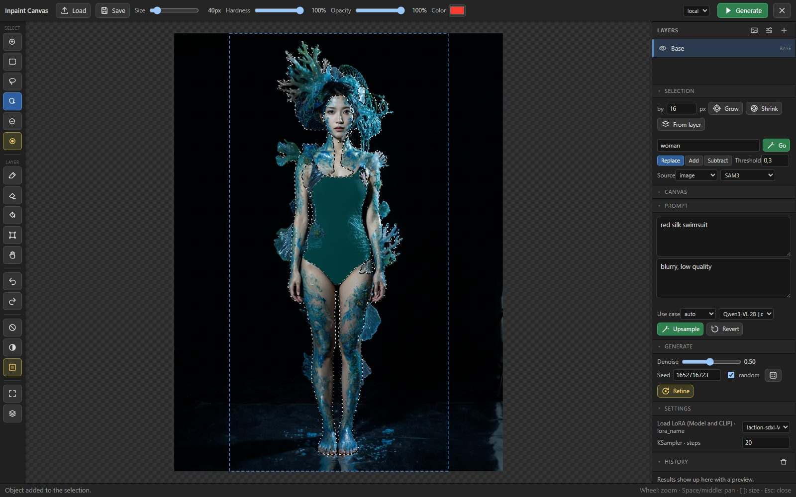
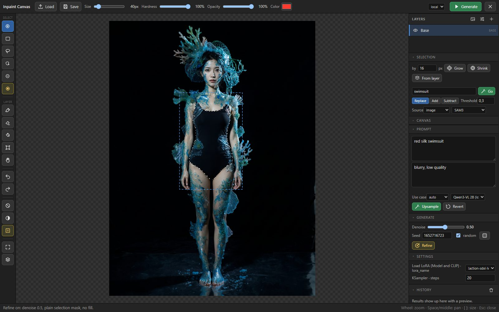
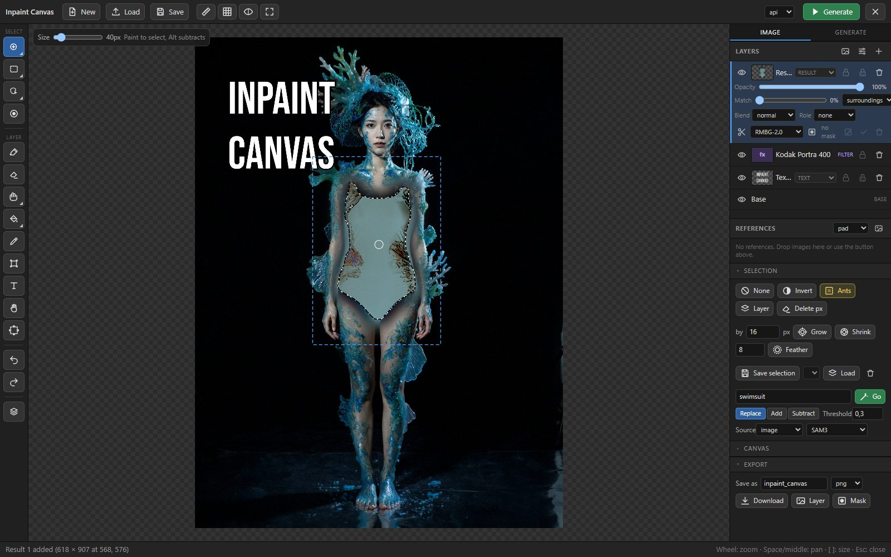

# ComfyUI-InpaintCanvas

Krita-style inpainting without leaving ComfyUI. One node holds the image, the
layers, the selection and the prompt. The selected region goes out as a crop,
any inpaint chain works on it, and the result is wired straight back into the
same node, where it lands as a new layer. Select the next spot, generate again.



**Video tutorial** (3 min): swapping the wheels on a BMW 635 CSi with a
reference image, prompt upsampling and a film grain finish.

[](https://www.youtube.com/watch?v=n3obFaFfn_0)

Highlights

- Full-window editor with selection brush, rectangle, lasso, loop closing,
  object selection by hovering (SAM2), select by text (SAM3 or GroundingDINO +
  SAM), grow / shrink, layers with blend modes, paint and erase, transform
  with rotate, distort and warp, control layers for ControlNet, outpainting.
- Reference layers for Flux.2 / Kontext multi-reference editing: drop images
  onto the canvas, they travel with `crop_image` as extra batch images.
- Layer masks and cutouts: background removal with the installed RMBG nodes
  (RMBG-2.0, BiRefNet, BEN2, BRIA) becomes an editable transparency mask.
- Filter layers to finish the picture: grain, sharpen, blur, levels, curves,
  brightness / contrast, hue / saturation, colour balance, black & white,
  LUT (.cube) and vignette, non-destructive, with masks and undo.
- Prompt upsampling with a local vision-language model (Qwen3-VL) or Gemini,
  tuned per use case: an edit instruction for Flux.2 / Kontext by default,
  or fill, add, remove, outpaint descriptions.
- Save the finished image with the workflow embedded, and clean up the
  node's working files from inside the editor.
- Auto context and auto feather derived from the selection size, fill modes
  for the masked area, colour matching when the result is stitched back.
- An API / Local switch with two result inputs: only the chain of the chosen
  mode runs, so a paid API node stays idle while you work locally.
- Denoise, seed, negative prompt and up to eight editor-driven setting outputs
  (LoRA name, checkpoint, steps, anything with a widget) so you can steer the
  graph from inside the editor.
- Helper prompts for segmentation and upsampling run at the front of the
  queue with only the model nodes they need. Your generation chain is never
  triggered by them.

## Installation

```bash
cd ComfyUI/custom_nodes
git clone https://github.com/DenRakEiw/ComfyUI-InpaintCanvas
```

Restart ComfyUI. The node itself has no extra Python dependencies beyond what
ComfyUI ships (OpenCV is used for the *border* fill when available).

Optional node packs, each enabling one editor feature:

| Feature                   | Node pack                                                   | Models                                                        |
| ------------------------- | ----------------------------------------------------------- | ------------------------------------------------------------- |
| Select by text (default)  | [comfyui-rmbg](https://github.com/1038lab/ComfyUI-RMBG) (SAM3) | `models/sam3/sam3.pt` (downloaded by the node on first use)  |
| Select by text (fallback) | [comfyui_segment_anything](https://github.com/storyicon/comfyui_segment_anything) | GroundingDINO SwinT + SAM in `models/grounding-dino`, `models/sams` |
| Object selection (hover)  | [ComfyUI-segment-anything-2](https://github.com/kijai/ComfyUI-segment-anything-2) | `sam2_hiera_base_plus.safetensors` in `models/sam2`        |
| Prompt upsampling         | [ComfyUI-QwenVL](https://github.com/1038lab/ComfyUI-QwenVL) or ComfyUI's Gemini API node | Qwen3-VL 2B in `models/LLM/Qwen-VL` (downloaded on first use) |
| Layer cutouts             | [comfyui-rmbg](https://github.com/1038lab/ComfyUI-RMBG) (RMBG-2.0, BiRefNet, BEN2) or [ComfyUI-BRIA_AI-RMBG](https://github.com/ZHO-ZHO-ZHO/ComfyUI-BRIA_AI-RMBG) | `models/RMBG/<model>` (downloaded on first use); BRIA ships its weights |

The editor lists only the backends whose nodes are installed. Filter layers,
reference layers, masks, save and cleanup need nothing beyond the node.

## Quick start



1. Add **Inpaint Canvas**, click **Open editor**, load an image (button,
   Ctrl+V or drag and drop).
2. Wire `crop_image` (and `crop_mask`, `prompt`, `crop_width` / `crop_height`
   as your chain needs them) into your inpaint chain, and the decoded result
   back into `result` (API chain) or `result_local` (local chain).
3. Paint or pick a selection, type a prompt, press **Generate** (Ctrl+Enter).
4. The result comes back as a new layer. Compare, discard, refine, select the
   next region.

Minimal local chain:

```
Inpaint Canvas ─crop_image──▶ VAE Encode (for Inpainting) ─▶ KSampler ─▶ VAE Decode ─┐
               ─crop_mask───▶                              ▲ seed, denoise            │
               ◀─────────────────────────── result_local ◀────────────────────────────┘
```

With an API node (Flux.2 for example) wire `crop_image`, `prompt`,
`crop_width` and `crop_height` into it and its image output into `result`.
The stitch accepts any size and RGBA; a different aspect ratio is
center-cropped, never distorted.

## The editor

### Selecting

The selection is shown as a marching-ants outline like in Krita and
Photoshop; the dashed-square button in the toolbar switches to a red tint
(useful to see a soft or grown selection as an area). The blue dashed
rectangle is the crop that leaves the node, not the selection.

Rectangle and lasso replace the selection like in Krita and Photoshop; hold
Shift to add, Alt to subtract. The brush adds, with Alt it subtracts.

The tool column on the left groups related tools Photoshop-style: a button
shows the group's current tool and a small triangle; hover, right-click or
hold it to open the group (selection brushes, marquees, smart selection,
brushes, retouch, fill), and the shortcuts pick any tool directly. Two menu
buttons hold the selection actions and the view toggles.

Tools: brush (B), rectangle (R) and ellipse (Shift+R; Ctrl keeps
them square or round, dragging inside an existing selection moves its
outline), lasso (L), polygon (Shift+L: click point by point, click the first
point, double-click or Enter to close, Backspace removes the last point, Esc
cancels), magic wand (W: similar colour under the cursor, tolerance and
contiguous in the bar above the canvas), object selection (O), deselect brush
(D). **Quick mask (Q)** turns the paint and erase tools into selection
brushes and the bucket into a wand, with the selection shown as a red tint.
The Selection section grows, shrinks and **feathers** the selection (soft
edge, respected by painting, filling and the mask that is sent along), takes
it from a layer, and **saves** selections with the workflow to load them again
later (Shift+click adds, Alt+click subtracts). `[` and `]` change the brush size, the top bar holds
size, hardness, opacity and the paint colour.

- **Close loops** (toggle under the selection tools) works like Photoshop's
  Selection Brush: end a stroke where it started and the inside is filled as
  well. A small gap is bridged with a straight line, a loop against the image
  border counts, and the deselect brush cuts loops out the same way.
- **Object selection (O)**: on first use SAM2 finds every object in the image
  once (a few seconds). Then the object under the mouse lights up in cyan,
  click adds it, click again removes it, Shift always adds, Alt always
  subtracts. Small objects win over the large ones containing them, a face
  over the person. The map refreshes itself when the image changes.

  

- **Select by text**: type what you want ("shirt", "hair", "the red car"),
  press Go or Enter, and the mask comes back as the selection in the chosen
  mode (Replace, Add, Subtract). Leave the field empty and press Go with a
  prompt written below: the language model names the object the prompt is
  about ("roter Seiden-Badeanzug" gives "bathing suit"), that term is
  segmented and shown in the field. *Threshold*: lower finds more. *HQ*
  (GroundingDINO + SAM only) uses the large SAM model.
- **Source**: what the segmentation models look at. *image* is the flattened
  visible layers, exactly what your chain sees. *active layer* shows the model
  only that layer on neutral grey and clips the result to its pixels, so you
  can pick objects inside a result or paint layer without the base
  interfering. Applies to both select by text and object selection.
- **Grow / Shrink** by n pixels (exact distance transform), **From layer**
  takes the opaque area of the active layer. Clear the selection (Ctrl+D),
  invert it (Ctrl+I). **Clear** (Del) deletes the selected pixels of the
  active layer, like Krita: select what you want to keep, invert, Del.
  Without a selection, Del deletes the active layer. **Ctrl+C** copies the
  selected pixels of the active layer (Ctrl+Shift+C from everything
  visible), **Ctrl+X** cuts them, **Ctrl+V** pastes them as a new layer at
  the same place. An image from the system clipboard becomes a new layer
  when a base is loaded, the base otherwise.

### Layers

- Paint (P) and erase (E) on the active layer; painting on the base creates a
  paint layer automatically, the base itself is never erased. Fill the
  selection with the colour (Shift+F). Soft brushes stamp radial dabs, opacity
  applies per stroke. With a selection present, brush and eraser only touch
  the selected area, like in Krita and Photoshop; clear the selection
  (Ctrl+D) to paint freely. The eraser has its own hardness, soft by default like
  Krita's Eraser Soft; the Hardness slider always shows and edits the active
  tool's value, both are remembered. Shift+click draws a straight line from
  where the last stroke on that layer ended; a pen's pressure scales the
  brush size.
- **Eyedropper (I)**, or Alt+click with the brush: picks the colour under the
  cursor from the visible image (or the active layer, bar above the canvas).
- **Bucket (G)**: fills the connected area of similar colour under the cursor
  on the active layer (a new paint layer on the base), within the selection.
  Tolerance, contiguous and the sample source (image or layer) are in the
  bar above the canvas. **Gradient (Shift+G)**: drag to draw a linear or
  radial gradient from the colour to transparent, white or black.
- **Smudge (Shift+S)**: drags the pixels along the stroke like a finger in
  wet paint, with a strength slider; the tool of choice for a hard seam
  after inpainting. On the base it first adds a copy layer.
- **Clone stamp (S)** and **healing brush (J)**: Alt+click sets the source,
  then paint to copy from there onto the active layer (new paint layer on
  the base). The healing brush shifts the copied texture to the colour and
  brightness of where it lands. *Aligned* keeps the offset between strokes,
  *Sample* takes the visible image or the layer alone.
- **Transform (T)** has four modes in the bar above the canvas. *Scale*: drag
  inside to move, corners scale proportionally (Shift for free aspect), edge
  handles scale one axis, arrow keys nudge (Shift: 10 px). Drag just outside
  a corner to rotate, as in Krita and Photoshop (Shift snaps to 15°); while
  the rotation is pending the handles still scale and the inside still moves,
  Enter bakes it. *Rotate* does the same from the bar with an angle field.
  *Distort*: drag the four corners (perspective). *Warp*: bend the layer with
  a 3 to 6 point grid. Rotate, distort and warp preview live and are baked
  with Enter or Apply, Esc cancels, undo restores the layer completely. The
  bar also has numeric X / Y / W / H fields, flip horizontal / vertical,
  rotate 90° either way and centre. While moving, the layer snaps to the
  canvas edges and centre (pink guide, Alt moves freely).
- **Text (Shift+T)**: click on the canvas to add a text layer. The layer
  panel holds the text (several lines), font, size, colour, bold / italic,
  alignment, line height, letter spacing and an outline. 17 open-source fonts
  come with the node (Roboto, Open Sans, Montserrat, Oswald, Bebas Neue,
  Anton, Abril Fatface, Bangers, Playfair Display, Lora, Cinzel, Lobster,
  Pacifico, Dancing Script, Caveat, Permanent Marker, Roboto Mono; OFL /
  Apache licensed, see `js/fonts/licenses`). The + next to the font list
  uploads your own .ttf / .otf / .woff files to `input/inpaint_canvas/fonts`,
  where they stay available. Text layers are ordinary pixel layers for
  everything else: move them with the text tool, scale and rotate with T,
  mask them, blend them; editing the text renders them again.
- The layer list (right): click to activate, Ctrl+click on the canvas
  activates the topmost layer with a pixel under the cursor. Each row has a
  thumbnail, the eye (Alt+click: solo, again to restore), the name
  (double-click renames), a lock (no painting, moving, merging, deleting), an
  alpha lock (paint only lands on existing pixels), opacity, blend mode
  (multiply, screen, overlay, ...) and delete (Delete key). Drag a row's
  header to reorder, or Ctrl+] / Ctrl+[ ; Ctrl+J duplicates, Ctrl+E merges the
  layer into the one below (the bottom layer into the base), the plus button
  adds an empty paint layer (Ctrl+Shift+N). Flatten bakes all visible layers
  into the base. Deleting, reordering, merging and duplicating are undoable.
- **Match** (per layer, non-destructive): shifts the layer's colours and
  contrast towards the image below it, per channel by mean and spread like
  the stitch's colour match, dosed by the slider. Source *surroundings*
  measures a ring around the layer's opaque area, *underneath* the pixels
  the layer covers (for results that replace what was there). Fixes a
  result generated without colour match, a pasted cutout in a new scene or
  an imported photo with a different white balance; applied in the
  preview, in flatten, in the run and when saving.
- **Control layers**: give a layer a role (scribble, lineart, depth, pose,
  canny, other). Such layers are left out of the image your chain sees and
  instead composited on black into the `control_image` output, cropped and
  scaled exactly like `crop_image`. Feed it to ControlNet.
- **Image layers**: drag an image onto the canvas and it opens as a new
  layer centred on the drop point, at native size (fitted to the canvas when
  larger); several files cascade from there. The image button in the Layers
  header and dropping onto the layer list do the same at the origin, and an
  image pasted from the system clipboard lands as a layer too. Ctrl+drop
  replaces the base image instead; with no image loaded a drop loads the
  base.
- **Reference layers** (Flux.2 / Kontext multi-reference editing): the
  dashed image button in the Layers header uploads one or more files as
  layers with the role *reference* (dropping files onto the canvas with
  Shift does the same). Reference layers are shown on the canvas with a
  cyan frame and their batch number, but they are not part of the image your
  chain sees. Instead they are appended to the `crop_image` batch, top of the
  list first, fitted to the crop's size (cutout masks applied, transparency
  on white). The Flux.2 API nodes flatten batches into their image inputs,
  so the one link you already have carries the crop and all references;
  without reference layers `crop_image` stays a single image and nothing
  downstream changes. Any layer can be turned into a reference through its
  role select, a hidden reference layer is left out. *References* in the
  Canvas section chooses how a reference is fitted to the crop size: *pad*
  with the image's border colour, *crop* to cover, or *stretch*. Not for
  chains that VAE-encode `crop_image`, they would encode the references too.
- **Filter layers**: see the section below.
- **Layer masks and cutouts** (Krita's transparency masks, LayerForge's
  background removal): every layer row has a mask row. *Cutout* runs one of
  the installed background removal nodes on the layer (comfyui-rmbg's
  RMBG-2.0, BiRefNet or BEN2, or BRIA RMBG 1.4; the model select shows up on
  the active layer) and turns the result into a transparency mask, so a
  product shot or a pasted photo becomes a cutout without touching its pixels.
  *Mask from selection* keeps only the selected part visible. With a mask
  present, the pencil toggle switches the paint (reveal) and erase (hide)
  tools onto the mask, Shift+F reveals the selection; the check applies the
  mask to the pixels, the trash removes it. Masks are undoable, survive a
  reload, and are respected by *From layer*, the segmentation source *active
  layer*, the reference batch and the run image.

### Filter layers

The fx button in the Layers header adds a layer without pixels that filters
everything below it. Opacity, blend mode and a transparency mask work like
on any layer, so *mask from selection* limits a sharpen or a grain to the
inpainted patch. Sliders preview at reduced resolution while you drag and
render in full when you let go; every drag is one undo step. Filters are
baked into the image your chain sees and into flatten, extend and save.
Filter layers have no pixels of their own, so painting, transforming and
cutout are not available on them (mask editing is).

- **Film / Grain**. Film-like grain, strongest in the midtones, with a
  colour share. Its distribution follows what real grain scans measure:
  skewed, bright specks on a darker ground, set by the *Speckle* slider.
  The *Film* select holds about fifty stocks in groups: colour negative from
  Ektar and Portra to Gold, UltraMax and Superia; slide films such as
  Ektachrome, Kodachrome, Velvia and Provia; black-and-white from Pan F to
  Tri-X, Delta 3200, Ortho and infrared; cine stocks such as Vision3 and
  CineStill; and special films such as LomoChrome Purple, Turquoise and
  Metropolis, Aerochrome, redscale, cross-processing, expired and instant
  film. A preset sets the grain and a parametric colour character whose
  strength the *Look* slider controls. These are approximations of how the
  stocks are described, not measurements; a real film LUT below the grain
  layer stays the faithful route for colour. With *Plate* you load a real
  grain plate, a scan of uniformly exposed film such as the fotokorn.de
  packs, which then replaces the synthetic grain at the chosen scale.
- **Sharpen**: unsharp mask with amount, radius and threshold.
- **Gaussian blur**: radius in image pixels (0–64). The edges blur into a
  mirrored copy of the picture, so nothing goes dark or transparent at the
  border.
- **Levels**: input black and white point, gamma, output black and white.
- **Curves**: a curve editor in the layer row with a master (RGB) curve and
  one per channel. Click adds a point, drag moves it, dragging it out of the
  box or double-clicking removes it, the end points move only vertically.
  The curve is a smooth monotone spline (no overshoot), the master curve is
  applied first, then the channel curves; a luma histogram of what the
  layer sees is drawn behind the curve. *Reset* straightens the current
  channel, Shift+Reset all four.
- **Brightness / Contrast**: brightness lifts or lowers with the ends
  protected (white stays white, black stays black); contrast pivots around
  mid grey like Photoshop's legacy control (+100 is nearly a threshold,
  −100 flat grey).
- **Hue / Saturation**: hue rotation (±180°), saturation (−100 = grey,
  +100 doubles) and lightness (blends towards white or black), like
  Photoshop's Hue/Saturation in master mode.
- **Colour balance**: cyan–red, magenta–green and yellow–blue for shadows,
  midtones and highlights each, with *Preserve luminosity* (on by default)
  keeping the brightness where it was.
- **Black & white**: channel weights for red, green and blue (30/59/11 by
  default; only their ratio matters) like Photoshop's Black & White, plus a
  tint hue and strength for sepia and split-tone looks.
- **Invert**: negative of the image below (no parameters).
- **LUT**: load any 3D `.cube` with a strength slider; the LUT is stored
  with the workflow.
- **Vignette**: amount, size and softness.

### Prompt and upsampling

The prompt field is stored with the workflow and leaves the node on the
`prompt` output. **Upsample** (Ctrl+U) lets a vision-language model rewrite a
short request (any language) into a proper English prompt. It sees the crop
with the selection outlined in magenta (solid green when Fill is green) and
writes for the chosen **use case**:

| Use case   | What it writes                                                              |
| ---------- | --------------------------------------------------------------------------- |
| fill       | what the area should show, matching materials, lighting and perspective    |
| add        | a new object with scale, contact shadows and the scene's lighting          |
| remove     | only the background that should appear, never naming the object            |
| edit       | one verb-first instruction for editing models (Flux.2, Kontext, Klein): the requested change with its exact colours and materials, then what stays unchanged |
| outpaint   | the scene continued beyond the border                                      |
| auto       | outpaint when the selection touches the border, edit otherwise             |

When the selection came from select by text, the model is also told what the
outline contains. **Revert** brings the previous prompt back. Backends:
Qwen3-VL 2B locally (short English requests are the most reliable; German
requests occasionally lose a word, so read the result), Qwen3-VL 4B
(downloaded on first use, about 8 GB, better at *remove* and at translating),
or Gemini through ComfyUI's API node.

### Generate: API or local, denoise, seed, refine



- The **api / local** switch next to Generate says which chain the result
  comes back from: *api* uses the `result` input, *local* the `result_local`
  input. Only the chain wired to the selected input runs. When only one of the
  two inputs is wired, that one is used whatever the mode says, and the Crop
  panel says so ("only input wired"); it warns when nothing is wired at all.
- **Denoise** (a slider, local mode: 1.0 repaints the selection, lower
  values refine what is there) and **Seed** with a *random* toggle and a dice
  button leave the node on the `denoise` and `seed` outputs. Wire them into
  your sampler.
- Local mode adds **Refine**: the selection goes to the sampler as a plain,
  unfeathered mask without fill, the seam still blends softly when stitching.
  Switching it on drops denoise to 0.5 if it was at 1. The auto feather also
  scales with denoise in local mode, so a gentle refine gets a narrower
  transition than a full repaint.
- Local mode shows a **negative prompt** field under the prompt (`negative`
  output, for SDXL-class models).

### Settings driven from the editor

The node ends with `setting 1 (free)`. Wire it into any widget input of
another node, a LoRA loader's `lora_name`, a checkpoint name, `steps`, `cfg`,
a sampler name, and the next free setting output appears, up to eight. The
editor's Settings section shows a matching control for each connected one: a
drop-down with the model list, a number field, a checkbox or a text field. It
starts from the value the widget had when you connected it, so nothing changes
until you touch it, and edits are pushed to the widget right away. The values
travel with the canvas in the workflow.

### Crop settings

The dashed rectangle on the canvas is the crop that will be emitted: the
selection's bounding box plus context. The Crop panel shows its size, the
size that actually leaves the node, and four settings stored with the canvas:

- **Context** *auto* sizes the context from the selection (6 % of the
  selection diagonal plus the feather plus 4 px) and never emits a crop
  smaller than 512 px on a side when the image allows it. Small fixes get a
  tight crop, large selections get room. *manual* uses the `padding` widget.
- **Feather** *auto* derives the mask edge from the selection size the way
  the Krita AI plugin does: feather 10 % of the diagonal (at least 32 px), a
  4 px hard grow plus half the feather, a blend of at most 25 px for the
  composite. `crop_mask` is then the grown and feathered mask, and the stitch
  keeps the result fully opaque inside your selection with a soft transition
  outside it. *manual* emits the raw selection and blurs the edge by the
  `feather` widget at stitch time.
- **Fill** changes what the model sees inside the selection in `crop_image`
  (the canvas itself is untouched): *neutral* the average colour of the
  surroundings, *blur* the surroundings smeared into the area, *border* an
  OpenCV border fill plus smear, *green* pure green with a hard edge for edit
  models that are told to "fill the green area". Use one of these when the
  model keeps the old content instead of replacing it.
- **Original** (with a fill mode) sends the untouched crop along: `crop_image`
  becomes a batch of two, the filled crop first, the original second. An edit
  model that only gets a green head sees hair from behind and paints the back
  of a head; with the original next to it, it knows what is under the green.
  The Flux.2 API node flattens the batch into two input images. Not meant for
  VAE Encode chains, which would encode both.
- **Paste** decides what of the result lands on the canvas: *selection*
  keeps only the selected area with a soft edge along the selection, *whole
  crop* pastes the entire returned rectangle with a soft border at its edge.
  Edit models such as Flux.2 re-render the crop as a whole and it is
  consistent in itself; pasting only the selection meets the original along
  the selection border, and where that border crosses a contour the two can
  disagree, which shows as doubled lines. *Whole crop* keeps the model's
  result intact.
- **Align** registers the result to the unchanged surroundings before it is
  stitched (an affine fit on the ring around the selection, applied only when
  it measurably improves the match). Edit models often shift or slightly
  rescale the content; without alignment every contour the selection border
  crosses shows up doubled. Rounding the emitted size to the multiple can
  also change the aspect ratio by a few percent; the Crop info warns about
  it, and the stitch stretches such a result back exactly.
- **Color match** matches the result's colours and brightness to the ring
  around the selection when it is stitched back, so results that come back
  with a colour shift leave no visible seam.

Workflows saved before these settings existed load with manual context, manual
feather, no fill and no colour match, so nothing changes for them.

### Outpainting

The **canvas tool (C)** shows the canvas as a frame: drag its edges or corners
outward to extend, inward to crop; the new size and the pixels per side are
shown while you drag, and releasing applies it (8 px steps, Alt for single
pixels); Ctrl+Z takes it back. Cropping keeps every layer's pixels, they just
shift. The Canvas section does the same with numbers (negative crops) and the
**Apply** button, and **Resize** scales the whole image with its layers and
selection to a new size. When extending, the visible image is baked into the
new base and the border becomes the selection. **Border** chooses
what fills it before the model sees it: the image's average colour (default),
neutral grey, green for edit models, black, random noise for latent models, or
stretched edge pixels. Press Generate to fill it; the *outpaint* use case of
the upsampler writes the matching prompt. Control and reference layers survive
the extension.

### Saving the finished image

**Save** in the top bar (Ctrl+S) writes the visible image, filters applied,
control and reference layers left out, into ComfyUI's `output` folder. Name
and format are set in the Canvas section: PNG carries the workflow and the
canvas prompt as metadata like SaveImage does, so the file can be dropped
onto ComfyUI to bring the workflow back; JPEG and WebP are smaller. **PSD**
(Photoshop) and **ORA** (OpenRaster, the native layered format of Krita and
GIMP) keep the layers: the base as *Background*, every pixel layer with its
name, position, opacity, visibility and blend mode (control and reference
layers hidden), plus the merged image. Filter layers cannot be represented
in either format and are only part of the merged image. **Download** saves
and hands the file to the browser as well. **Layer** saves the active layer
alone as a PNG with transparency, **Mask** the selection as a black and
white PNG. Saving the same image twice does
not create a second file, a changed image gets a counter appended. The
node's `image` output is the same picture for chains that want to save or
post-process it with nodes.

### Cleaning up files

Uploads, results and helper masks accumulate in `input/inpaint_canvas`,
`output/inpaint_canvas` and `temp/inpaint_canvas`. **Clean up files** in the
Canvas section deletes the node's own working files (`n<id>_..._<hash>.png`)
that nothing uses any more; images you loaded under their own name and
images you saved are never touched. Kept are files referenced by an open
editor, an open workflow tab, the browser's stored workflows or any saved
workflow (every `.json` under ComfyUI's `user` directory) are kept, and so is
anything younger than two minutes. You see the counts and sizes and confirm
before anything is deleted. Discarded history results whose files are gone
can no longer be restored. Helper results in `temp/inpaint_canvas` older than
an hour are pruned automatically on the next helper run.

### History



Every result is listed with a preview, the prompt it was made with, the mode
and the seed. Click a preview (or the solo button) to show only that result,
discard one to remove its layer, restore a discarded one later, click the seed
line to reuse that seed. The trash icon in the header clears the list; layers
and files stay.

### Keyboard

| Keys                         | Action                                   |
| ---------------------------- | ---------------------------------------- |
| B, R, Shift+R, L, Shift+L    | selection brush, rectangle, ellipse, lasso, polygon |
| W, O, D, Q                   | magic wand, object, deselect brush, quick mask |
| P, E, T, H                   | paint, erase, transform, hand            |
| I, G, Shift+G                | eyedropper, bucket, gradient             |
| Shift+S, S, J                | smudge, clone stamp, healing brush       |
| 1, F, 4 / 6, 5               | zoom 100 %, fit, rotate the view, reset  |
| Ctrl+Shift+R, Ctrl+Shift+G   | rulers, grid                             |
| \ (hold)                    | before / after: the base without layers  |
| Shift+T, C                   | text tool, canvas tool                   |
| `[` `]`                      | brush size                               |
| Ctrl+Z, Ctrl+Shift+Z, Ctrl+Y | undo, redo                               |
| Ctrl+D, Ctrl+I               | clear, invert selection                  |
| Shift+F                      | fill selection with colour               |
| Ctrl+Shift+N                 | new paint layer                          |
| Ctrl+J, Ctrl+E               | duplicate layer, merge down              |
| Ctrl+], Ctrl+[               | move layer up / down                     |
| Ctrl+click on the canvas     | select the layer under the cursor        |
| Ctrl+C, Ctrl+Shift+C, Ctrl+X, Ctrl+V | copy selection (from layer / merged), cut, paste as new layer |
| Delete                       | clear the selected pixels of the active layer; without a selection delete the layer |
| Ctrl+U                       | upsample prompt                          |
| Ctrl+S                       | save the finished image                  |
| Ctrl+Enter                   | generate                                 |
| F                            | fit to view                              |
| Space / middle mouse / right mouse | pan (wheel zooms)                  |
| Esc                          | cancel transform, close editor           |

While the editor is open all shortcuts belong to it: Ctrl+Z undoes the last
editor step, not the workflow.

### View

Zoom with the wheel, pan with Space, the middle mouse or H; F fits, 1 shows
100 % (one image pixel per screen pixel), 4 / 6 rotate the view by 15° like
Krita and 5 resets it. The View buttons at the bottom of the tool column
toggle **rulers** (Ctrl+Shift+R; drag a guide out of a ruler, drag it back
to remove it, double-click a ruler clears them, layers snap to guides), the
**grid** (Ctrl+Shift+G, 64 px) and **before / after** (hold \ or click:
the base image without any layer). **Compare** in the History header shows
two results side by side with a draggable divider: the two newest, or
Ctrl+click a history thumbnail for A and Shift+click for B; Esc ends it.
Double-click a text layer with the text tool to edit the text right on the
canvas (Enter applies, Shift+Enter is a new line, Esc cancels). Edited layers
are uploaded automatically 15 s after the last change, so a browser crash
loses at most that much; the workflow itself is saved by ComfyUI.

## Node reference

### Inpaint Canvas (`InpaintCanvas`)

Widgets

| Widget        | Meaning                                                                     |
| ------------- | --------------------------------------------------------------------------- |
| `padding`     | Context pixels around the selection (Context = manual).                     |
| `target_size` | Longest side of the emitted crop. 0 keeps the native size.                  |
| `feather`     | Blur radius of the selection edge at stitch time (Feather = manual).        |
| `multiple_of` | Crop width and height are made a multiple of this. Flux wants 64.           |

With `target_size` set, the scaled crop is rounded to the multiple. With
`target_size` 0 the region itself is grown symmetrically until it is a multiple.
For API models that accept up to 2048 px, `target_size` 0 (or a value above
the region size) keeps the native resolution, so the result comes back as
sharp as the surroundings instead of being upscaled.

Inputs (both optional, both lazy)

- `result`: the result of your API chain (editor mode *api*).
- `result_local`: the decoded result of your local chain (editor mode *local*).

Outputs

| Output                       | Content                                                                 |
| ---------------------------- | ----------------------------------------------------------------------- |
| `crop_image` / `crop_mask`   | the region to inpaint, scaled, with fill and grown / feathered mask applied when on. `crop_image` becomes a batch when there is more to send: the untouched crop (**Original** with a fill mode), then the visible reference layers fitted to the crop size |
| `image` / `mask`             | the flattened canvas and the raw selection at full size                 |
| `stitch_info`                | parameters for the standalone stitch node                               |
| `crop_width` / `crop_height` | size of `crop_image`, for generators that take an explicit size         |
| `prompt` / `negative`        | the editor's prompt fields                                              |
| `control_image`              | control layers on black, aligned with `crop_image` (black if none)      |
| `denoise` / `seed` / `mode`  | the Generate settings (`mode` is "api" or "local")                      |
| `setting_1` ... `setting_8`  | wildcard outputs driven from the editor's Settings section              |

Only ever appended, so saved workflows keep working. The node shows only the
connected setting slots plus one free one. (A `reference_images` output
existed for a few hours on 2026-09-05; references now ride in `crop_image`,
and the old output is removed from loaded workflows.)

### Inpaint Canvas Stitch (`InpaintCanvasStitch`)

The stitch step as an explicit node: `result` + `stitch_info` in, the stitched
full image out. You only need it when you do not want the back-link on the
canvas node. Its result is still delivered to the canvas as a layer.

### Helper nodes

Used by the editor's helper prompts; you can also wire them yourself.

- `Inpaint Canvas Load Ref`: loads an image by a `{filename, subfolder, type}`
  JSON reference.
- `Inpaint Canvas Mask Out`: hands a MASK back to the editor (optional `label`
  text is echoed along; purpose `cutout` delivers a layer mask).
- `Inpaint Canvas Object Map`: runs SAM2's automatic mask generator (model
  from Kijai's `DownloadAndLoadSAM2Model` with segmentor `automaskgenerator`)
  and hands the editor an object label map.
- `Inpaint Canvas Text Out`: hands a STRING back to the editor.

## How the round trip works

ComfyUI rejects cycles, so the `result` links are never sent to the backend
as links. The frontend removes them from the prompt and passes the source
nodes as `result_source` / `result_source_local`. When the canvas node runs
it expands an ephemeral stitch node that reads from the source of the selected
mode; the other chain is not connected to anything and never executes. The
stitch's UI output is attributed to the canvas node, which is how the layer
arrives without a second visible node. Because the canvas node is an output
node, the chain runs even without a Save Image or Preview Image node.

The canvas node always re-executes: it cannot know whether the upstream chain
changed, and the stitch only happens while it runs.

Files: uploads go to `input/inpaint_canvas/`, stitched patches to
`output/inpaint_canvas/`, helper-prompt results to `temp/inpaint_canvas/`.
Edited layers are uploaded when the editor closes and before every run. The
workflow stores file references, the selection and the settings, not the
pixels of the layers.

## Development

See `DEVELOPMENT.md` for the mechanisms, measurements and test recipes, and
`CLAUDE.md` for the invariants that must not be broken.

## License

GPL-3.0, the same license as ComfyUI. See `LICENSE`. Free to use, modify and
redistribute, including commercially; forks and derived works must stay under
the GPL.
